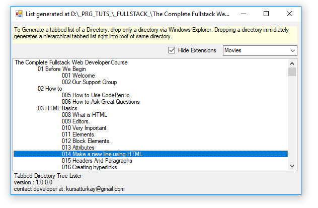
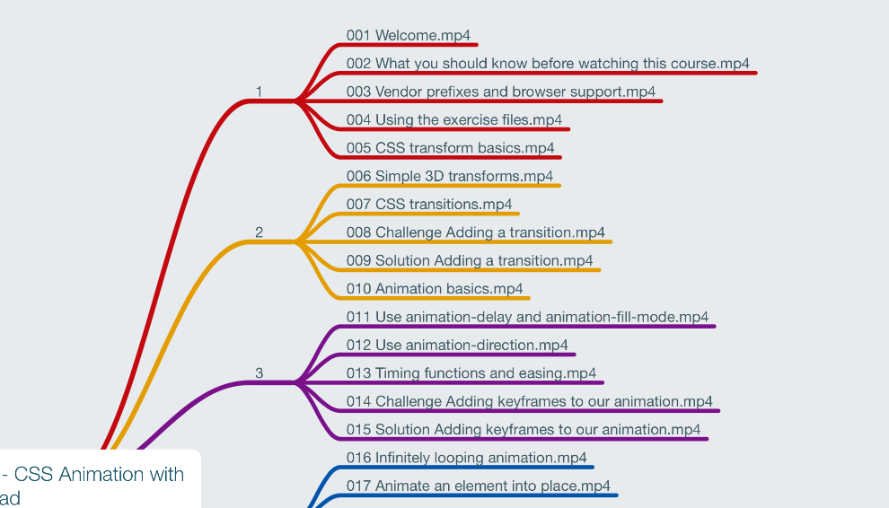

# TabbedDirTreeLister
Generates a Hierarchical Tabbed List of Dropped Directory and Saves as Text List into. Main Reason is Generate importable MindMaps to mindnode IOS app (This tool for Windows Desktop and Console)

as you drop a folder into form. you get a tabbed list file like image below:

so you are able import that file as mindnode network to mindnode(IOS) or similar mindmap apps

---
>## Authors
  **Kursat Turkay** - Contributor(aka "**Archer**") [TabbedDirTreeLister](https://github.com/kursatturkay/TabbedDirTreeLister)

>#### License
This project is licensed under the MIT License - see the LICENSE.md file for details

>
>## Contributing

Please read [CONTRIBUTING.md](https://github.com/kursatturkay/TabbedDirTreeLister/blob/master/CONTRIBUTING.md) for details on our code of conduct, and the process for submitting pull requests to us.